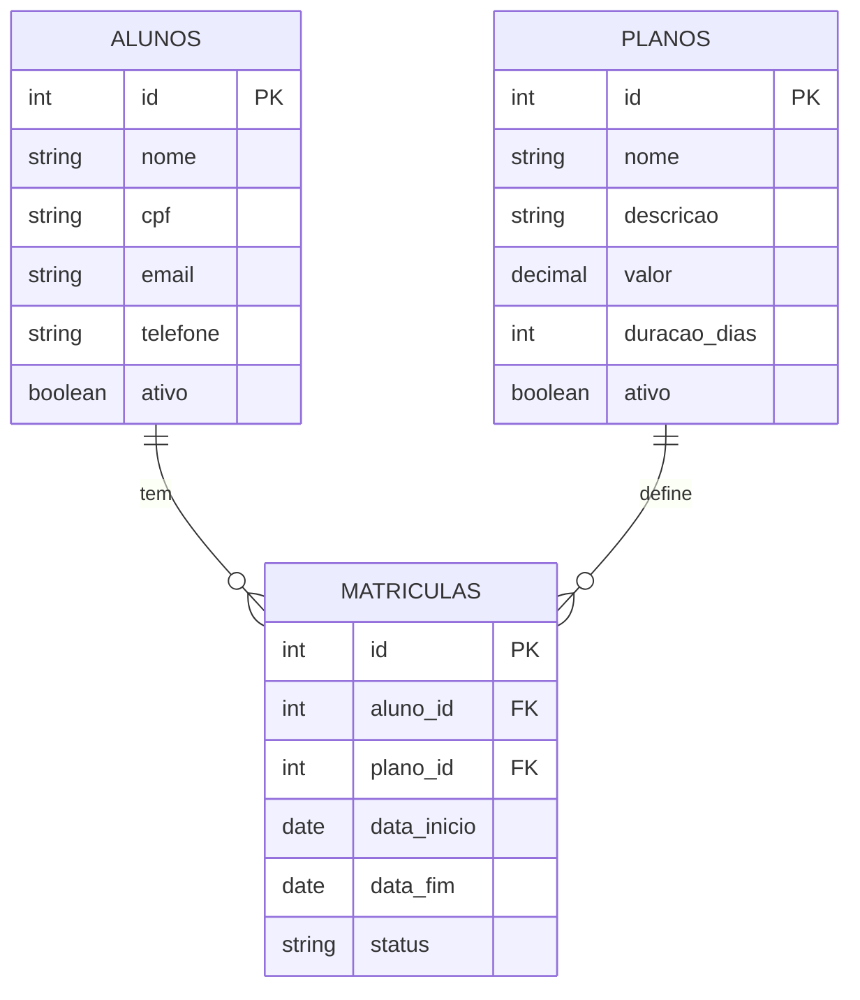
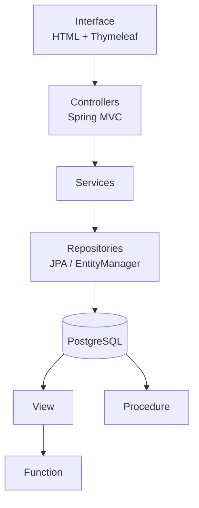

<div align="center">

# Sistema Academia

Gestão de alunos, planos e matrículas, com as regras de negócio vivendo dentro do PostgreSQL.


</div>

---

## Sobre

Projeto da disciplina de **Banco de Dados**. A ideia é simples: uma academia precisa saber quem são seus alunos, quais planos oferece e quais matrículas estão em dia. Em vez de espalhar isso em planilhas, o sistema reúne tudo em uma só aplicação web.

O foco do trabalho não é só o CRUD. A **View**, a **Function** e a **Procedure** do PostgreSQL fazem parte do funcionamento real do sistema: o Dashboard lê a View, a View usa a Function, e a renovação de matrícula é executada pela Procedure.

| Recurso | Nome | Onde aparece no sistema |
|---|---|---|
| View | `vw_matriculas_detalhadas` | Alimenta o Dashboard |
| Function | `verificar_situacao_matricula` | Calcula a situação de cada matrícula dentro da View |
| Procedure | `renovar_matricula` | Chamada pela tela de renovação |

## O que o sistema faz

**Alunos**
- cadastro e edição de dados (nome, CPF, e-mail, telefone)
- vínculo com um plano e definição da data de início

**Planos**
- cadastro e consulta, com valor e duração em dias
- controle de planos ativos

**Matrículas**
- data de término calculada a partir da duração do plano
- situação identificada automaticamente: `ATIVA`, `VENCIDA`, `INATIVA` ou `CANCELADA`
- renovação direto pela interface

**Dashboard**
- total de alunos, matrículas ativas e vencidas
- listagem com aluno, plano, vigência, status e situação

## Modelo de dados



Banco: `academia_db`, no PostgreSQL 18.3.

## Objetos do banco

### View `vw_matriculas_detalhadas`

Junta `alunos`, `matriculas` e `planos` em uma consulta só e devolve, para cada matrícula: dados do aluno, dados do plano, valor, duração, datas, status e a situação calculada. É a fonte de dados do Dashboard.

### Function `verificar_situacao_matricula`

Guarda no banco a regra que define a situação de uma matrícula. Recebe `p_data_fim` e `p_status` e segue esta ordem:

| Condição | Retorno |
|---|---|
| status é `CANCELADA` | `CANCELADA` |
| status é `INATIVA` | `INATIVA` |
| status é `ATIVA` e a data de fim já passou | `VENCIDA` |
| qualquer outro caso | `ATIVA` |

### Procedure `renovar_matricula`

Recebe `p_matricula_id` e `p_nova_data_fim`. Localiza a matrícula, atualiza a data de vencimento e volta o status para `ATIVA`. Se o ID não existir, lança um erro.

## Como as camadas se conectam



A View (com a Function dentro dela) responde às consultas do Dashboard. A Procedure só entra em cena quando alguém renova uma matrícula.

## Estrutura do projeto

```
sistema-academia/
├── src/main/
│   ├── java/com/academia/
│   │   ├── controller/
│   │   ├── model/
│   │   ├── repository/
│   │   └── service/
│   └── resources/
│       ├── static/
│       └── templates/
├── database/
│   ├── tables/       01_schema.sql
│   ├── functions/    01_verificar_situacao_matricula.sql
│   ├── views/        01_vw_matriculas_detalhadas.sql
│   ├── procedures/   01_renovar_matricula.sql
│   └── inserts/      01_seed.sql
├── pom.xml
└── README.md
```

## Rodando o projeto

**Você vai precisar de:** Java 27, PostgreSQL 18.3, Git e uma IDE (usei o IntelliJ IDEA). O Maven Wrapper já vem no projeto.

**1. Clone o repositório**

```bash
git clone https://github.com/JoaoPedroXav/sistema-academia.git
cd sistema-academia
```

**2. Crie o banco**

```sql
CREATE DATABASE academia_db;
```

**3. Rode os scripts da pasta `database/` nesta ordem**

1. `tables/`
2. `functions/`
3. `views/`
4. `procedures/`
5. `inserts/`

A ordem importa: a View depende da Function, e os inserts dependem das tabelas.

**4. Configure a conexão**

Crie o arquivo `src/main/resources/application.properties` com as suas credenciais. Ele não está no repositório de propósito.

```properties
spring.datasource.url=jdbc:postgresql://localhost:5432/academia_db
spring.datasource.username=SEU_USUARIO
spring.datasource.password=SUA_SENHA

spring.jpa.hibernate.ddl-auto=none
spring.jpa.show-sql=false
spring.jpa.properties.hibernate.format_sql=true

spring.thymeleaf.cache=false
```

**5. Suba a aplicação**

Pela IDE, execute `AcademiaApplication.java`, ou pelo terminal (Windows):

```bash
mvnw.cmd spring-boot:run
```

Depois é só abrir [http://localhost:8080](http://localhost:8080).

## Demonstração

https://youtu.be/WVPeBJaTSus?is=JCNZaBUKpcR0F8-D

## Autor

**João Pedro Xavier**
Disciplina: Projeto de Banco de Dados
Professor: *Anderson Soares*

---

<div align="center">
<sub>Projeto acadêmico · Banco de Dados</sub>
</div>
